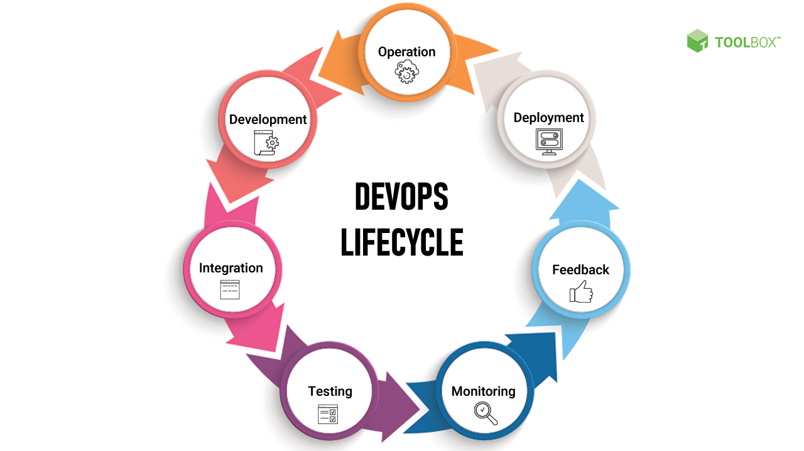

**DevOps Handbook:** A Guide to Modern Software Development

**Table of contents:**
1. Introduction to DevOps
2. Principles of DevOps
3. Key concepts in DevOps
4. DevOps tools and technologies 
5. Building a DevOps culture
6. Security in DevOps
7. Challenges in DevOps

**Introduction to DevOps:**

Welcome to the "DevOps Handbook," a guide crafted to assist professionals in modern software development.
In today's fast-paced tech world, merging development and operations is vital for organizations 
aiming to deliver top-notch software swiftly.

**Principles of DevOps:**

Collaboration: Foster collaboration between development, operations, and other stakeholders
 involved in the software development lifecycle.

Automation: Automate repetitive tasks to increase efficiency and reduce errors.
Continuous Integration and Deployment: Continuously integrate code changes into a shared repository 
and deploy them automatically to production environments.

Infrastructure as Code (IaC): Manage infrastructure through code to enable repeatability, scalability, and consistency.

Monitoring and Feedback: Monitor applications and infrastructure in real-time to gather feedback and improve performance.

Culture of Learning: Encourage a culture of learning, experimentation, and continuous improvement.

**Key Concepts in DevOps:**

Version Control: Utilize version control systems like Git to manage and track changes to code and configurations.

Microservices Architecture: Design applications as a collection of loosely coupled services that can be developed,
deployed, and scaled independently.

Containers: Use containerization technology like Docker to package and deploy applications 
and dependencies consistently across different environments.

Orchestration: Employ orchestration tools such as Kubernetes to automate the deployment, scaling, 
and management of containerized applications.

Infrastructure Automation: Automate infrastructure provisioning, configuration, 
and management using tools like Terraform or Ansible.

**DevOps Tools and Technologies:**

CI/CD Tools: Jenkins, GitLab CI/CD, Travis CI

Configuration Management: Ansible, Chef, Puppet

Containerization Platforms: Docker, Kubernetes

Infrastructure Provisioning: Terraform, AWS CloudFormation

Monitoring and Logging: Prometheus, ELK Stack (Elasticsearch, Logstash, Kibana)

**Building a DevOps culture:**

Encourage collaboration and communication between teams.
Foster a blame-free culture that encourages learning from failures.
Implement cross-functional teams to break down silos.
Provide training and resources to support continuous learning and skill development.
Recognize and reward contributions to the DevOps culture.

**How to maintain security in DevOps:**

Embed security practices into the development process.
Conduct regular security audits and vulnerability assessments.
Implement access controls and least privilege principles.
Automate security checks in the CI/CD pipeline.
Stay informed about security best practices and emerging threats.

**DevOps Lifecycle:**

**Real-Life Challenges in DevOps:**

Despite the numerous benefits of DevOps, organizations may encounter various challenges during its implementation.
Some common real-life challenges include:

Time wasting: 
During DevOps the ownership of the codebase changes from one team to another; from development to testing,
to deployment and production. During such transitions there is a general waste of time and effort as the environments used
by these teams are separately configured and the codebase must be modified to work smoothly on all these environments.

Challenges with Monitoring the DevOps process: 
One of the most common problems with DevOps is the challenge in holistically monitoring the entire process. DevOps consists
of several moving parts and each of these have different metrics to judge their effectiveness. 
For example a metric like number of code branches or deployment frequency might deal with the 
CI/CD process; whereas something like Defect Escape Rate is a part of the Continuous Testing pipeline. 

In conclusion to our guide to Modern Software Development, DevOps is a powerful approach that enables
organizations to deliver high-quality software faster and more reliably. By embracing DevOps principles,
adopting relevant tools and technologies, and fostering a culture of collaboration and continuous improvement,
teams can overcome traditional barriers between development and operations and achieve greater efficiency, agility,
and innovation in their software delivery process.
 

 References:

 BrowserStack By Sourojit Das, Community Contributor - January 25, 2023

 Altassian TOM HALL DevOps Advocate & Practitioner

 Altassian KRISHNA SAI Head of Engineering, IT Solutions

 TechRepublic Enrique Corrales - July 2023

