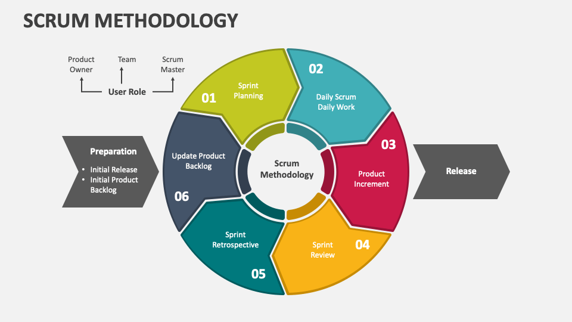
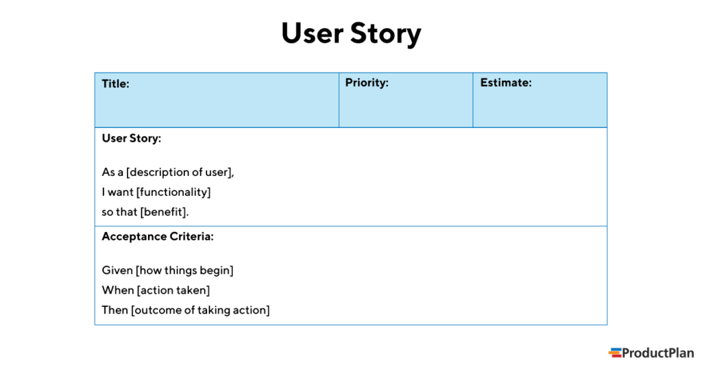
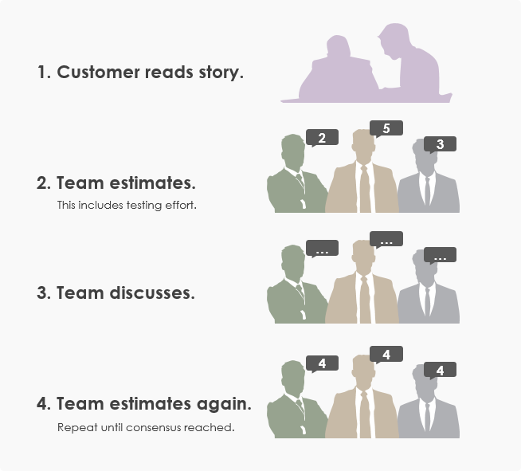

Welcome to our Handbook of Best Practices for Task Estimation in Scrum.
This guide is designed to equip both new and existing team members with essential knowledge and techniques for effectively estimating tasks within the Scrum framework.
By understanding the principles outlined in this handbook, you will contribute to the success of our projects by delivering value to our customers in a timely and efficient manner.

Scrum, as an agile framework, embodies core principles that emphasize iterative development, collaboration, and adaptability in response to change.
At its essence, Scrum enables teams to deliver value incrementally, with a focus on continuous improvement throughout the development process.
By embracing agile project management methodologies like Scrum, organizations can effectively navigate the complexities of modern software development and deliver high-quality products that meet evolving customer needs.

Key Principles of Scrum:

1. **Iterative Development**:
   Scrum promotes iterative development cycles known as Sprints, typically lasting between one to four weeks.
   Each Sprint delivers a potentially shippable increment of the product, allowing for rapid feedback and adaptation.
2. **Collaboration**:
   Collaboration is at the heart of Scrum. Cross-functional teams work together closely, with clear communication channels established between team members, stakeholders, and customers.
   This collaborative approach fosters creativity, innovation, and shared ownership of project outcomes.
3. **Responding to Change**: Scrum recognizes that requirements and priorities may change over time.
   Therefore, the framework encourages flexibility and adaptability, enabling teams to respond quickly to new information and emerging challenges.
4. **Adaptive Planning**:
   Rather than focusing to rigid, upfront planning, Scrum adaptes planning techniques.
   Teams plan for each Sprint based on current priorities and available information, allowing for adjustments as needed to optimize project outcomes.

By adhering to these fundamental principles, Scrum empowers teams to deliver value early and often, while also fostering a culture of continuous improvement and learning.

**Importance of User Stories in Task Estimation:**

User stories serve as a cornerstone of effective task estimation within the Scrum framework. These concise descriptions of features, told from the perspective of end-users, provide a clear and tangible representation of customer needs and expectations. By capturing requirements in the form of user stories, teams can ensure that their focus remains solely on delivering value to the customer.

Key Aspects of User Stories:

1. **Capturing Requirements**: User stories have specific functionalities that address the users needs. By articulating requirements in a user-centric manner, teams gain a deeper understanding of the problem domain and can tailor their solutions accordingly.
2. **Facilitating Collaboration**: User stories promote collaboration between stakeholders and development teams. By involving stakeholders in the creation and editing of user stories, teams ensure that their efforts are aligned with customer expectations and business objectives.
3. **Enabling Prioritization**: User stories provide a basis for prioritising work items within the product backlog. By assigning which is more important to each user story, teams can make informed decisions about which features to focus on during Sprint Planning.
4. **Enhancing Estimation**: User stories serve as the basis for task estimation in Scrum. By breaking down features into smaller, more manageable units of work, teams can estimate the effort required to implement each user story with greater accuracy.

Overall, user stories play a critical role in ensuring that development efforts are focused on delivering tangible value to the customer, while also providing a framework for effective task estimation within the Scrum framework.

**Popular Task Estimation Technique in Scrum:**

Task estimation is a vital aspect of Sprint Planning in Scrum, enabling teams to forecast the amount of work they can commit to during a Sprint accurately. Several estimation techniques are commonly used within the Scrum framework, each with its own benefits and considerations. Planning poker is one of the popluar techniques used.

If you are part of a team. This project involves completing different tasks such as like writing code, designing features, or fixing bugs. Each of these tasks has its own level of difficulty. Some are easy, and others are more complex.

Planning poker is like a game each memeber figures out how difficult each task is. These are the steps below:

1. **Team Gathering**: The team sits together to discuss the tasks that need to be done. These tasks are represented as "user stories" .
2. **Assigning Points**: Instead of just guessing how hard each task is, team members use "story points" to rate them. Story points are like units of measurement for task complexity. The higher the points, the more complex the task.
3. **Discussion and Consensus**: Each team member privately chooses a number of story points they think represents the complexity of a task. Then, everyone reveals their choices at the same time. If there are big differences in estimates, team members discuss why they chose their numbers and try to reach a consensus.
4. **Repeating the Process**: The team goes through this process for each task until they have estimates for all of them.

The goal of planning poker is to make sure everyone on the team understands the work involved in each task and agrees on how long it will take to complete them. This helps with planning the project timeline and ensures everyone is on the same page about what needs to be done.

By understanding Scrum principles, recognising the importance of user stories, and employing popular estimation techniques, teams can enhance their ability to deliver value efficiently and effectively within the Scrum framework.

References :

- Schwaber, K., & Sutherland, J. (2017). The Scrum Guide. Scrum.org.
- Highsmith, J. (2001). Agile Software Development Ecosystems. Addison-Wesley Professional.
- Cohn, M. (2004). User Stories Applied: For Agile Software Development. Addison-Wesley Professional.
- Patton, J. (2014). User Story Mapping: Discover the Whole Story, Build the Right Product. O'Reilly Media
  https://www.simplilearn.com/what-is-planning-poker-article
  https://www.productplan.com/glossary/planning-poker/
