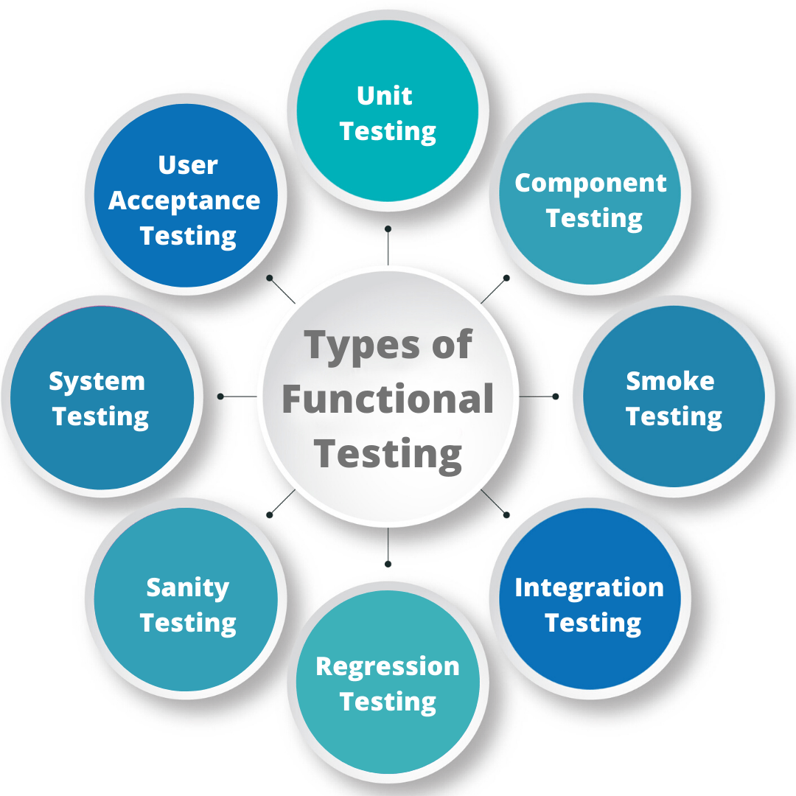

**This is the introduction part for Testing.**
This guide is tailored to create brand new team members as well as the experienced members possess knowledge of methods in the Testing.Therefore, as a result from adopting these norms we will improve the level of services for people, but nevertheless will have the projects for customers by the agreed time schedule. And, following expectation of clients, our projects will be appreciated by the clients. 

Testing of various software versions is done only when the quality of the software is exceptionally high. This posting focuses on testing deployment at every stage of the development lifecycle which is possible because of DevOps. There are various types of testing that we will discern and go in depth about the important factors that influence them such as risk-based testing and automation. We will also highlight the numerous benefits DevOps testing brings to developers, testers, and customers.

**Types of Testing =**

1- Unit Testing :
Unit test is the process where each code i.e. modules or components
are tested in isolation, so that there is no dependency on other code.

2- Integration Testing:
The term integration testing refers to a testing process, which provides 
feedback about various components or modules of a system, and allows researchers
to find out whether they operate together in compliance with intended rules.

**Different Aspects of testing =**

1- Metrics and Reporting:
It may involve the balance sheet be financial indicators like the number of test 
cases that are passed vs. failed, bugs detected, regular regeneration and re-test 
affected by DevOps testing, which shed light into which parts of the system most 
likely to fail.

2- Risk-Based Testing :
Testing in DevOps is very risk based to find out and remove the present problems 
from the portal where they can be managed in the early stage, allowing customers and 
owners to be in a constant state of the testing world.

3- Automation:
DevOps is making testing automation a vital part of software development. 
This helps developers to release the software in a faster and more consistent
manner without much quality or reliability issues using consistent testing frameworks.

**Benefits of testing with DevOps :**

1- Improved Efficiency and Speed-
Automation testing in DevOps makes routine processes of testing more economical 
and accelerated thus decreasing delivery cycle time and giving faster feedback 
to developers on developer's side as well as related bugs are identified earlier.

2- Wider Coverage and Consistency-
To start with, automated testing offers the advantage of adjustable coverage, 
it is more consistent, and finally the results are reliable. Ultimately, this 
results in better quality software releases.

3- Lower Testing Costs-
However, the initial investment for automated testing is reduced with very few
manual testing tasks as it speed up software delivery as compared to the traditional
testing method and can run for re-checking numerous number of times without adding 
the cost, hence, enhances the cost effectivity in the long run.

4- Improved Collaboration-
Test automation brings the developers, testers, and stakeholders together prompting 
them to address tasks, and facilitate quick feedback through early bug detection, and 
issue resolution. As a result teamwork is strengthened.

5- Higher Customer Satisfaction-
Autonomy testing which leads to reliable products, quick release of high-quality 
software products, and fewer customer complaints, the overall customer satisfaction 
and product quality are improved.

**References :**
Atlassian. (2023, March 23). Jira software automation: Basics & common use cases. https://www.atlassian.com/software/jira/guides/automation/overview

Ministry of Testing. (n.d.). Guide to integration testing. https://club.ministryoftesting.com/t/what-is-an-integration-testing-and-who-does-it/52290

Sauce Labs. (2021, September 22). Integration testing best practices. https://saucelabs.com/resources/blog/test-automation-best-practices

